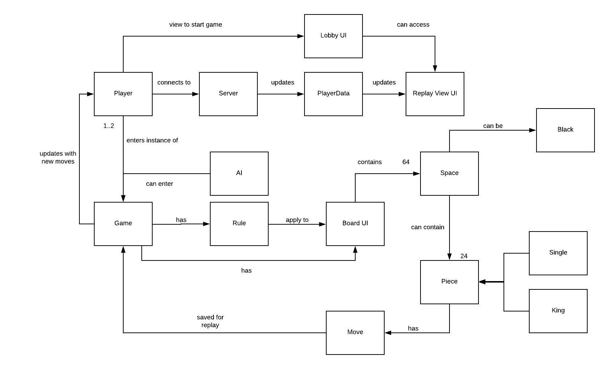
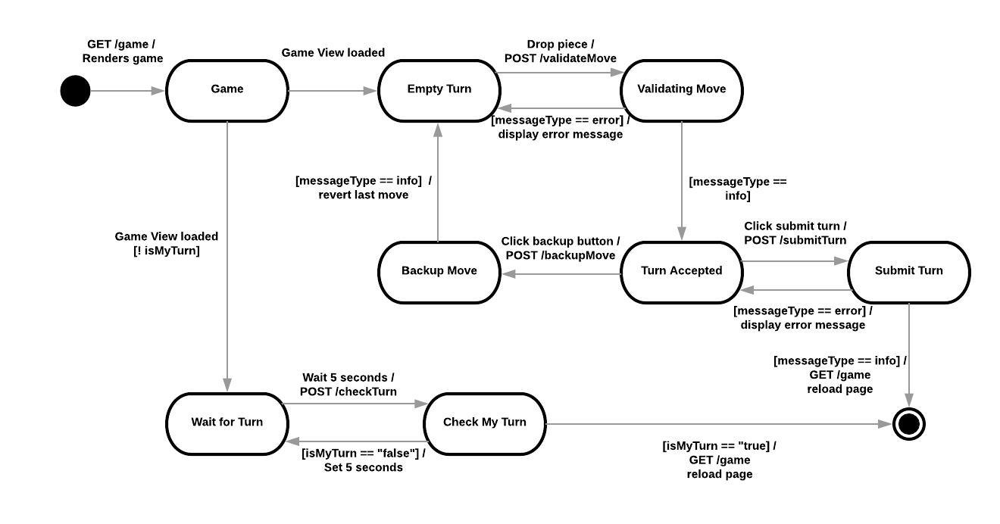
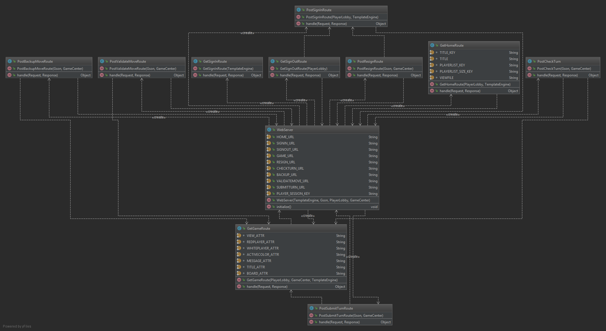
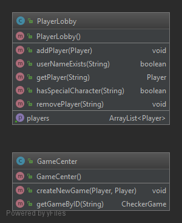
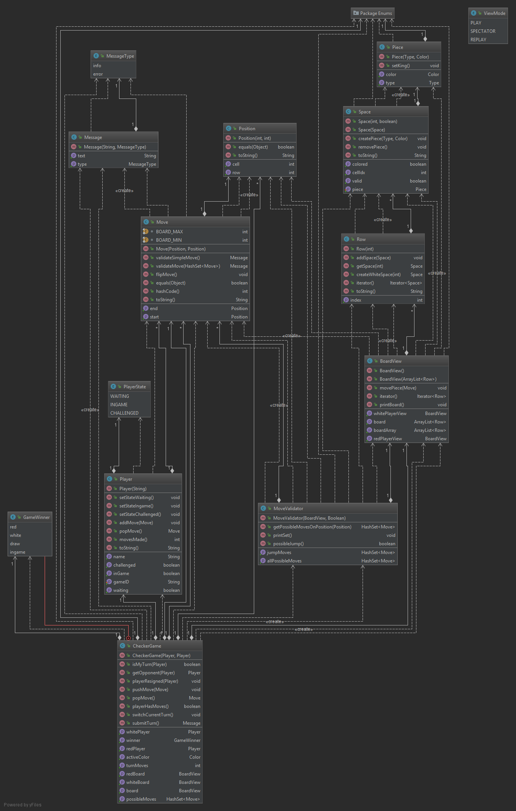
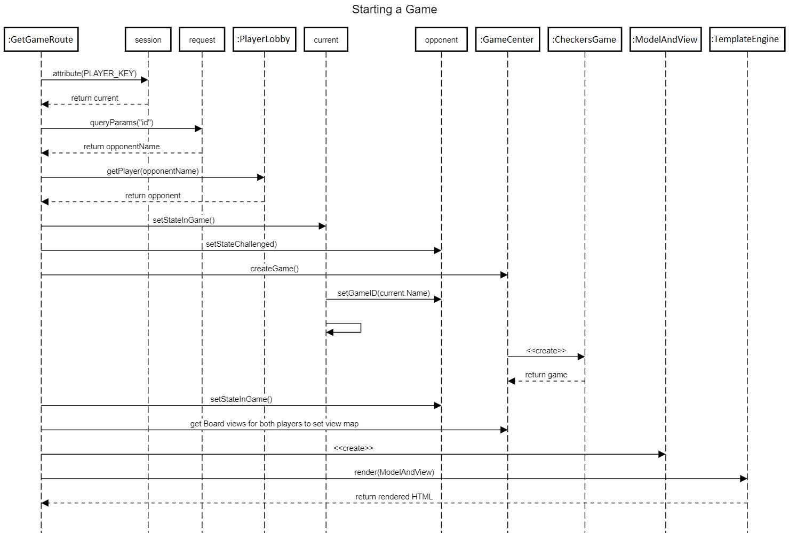
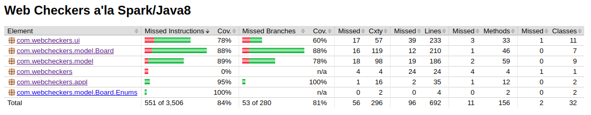

# PROJECT Design Documentation

## Team Information
* Team name: blooteam
* Team members
  * Dmytro Rudenkyy
  * Kevin Ta
  * Matt Preston
  * Cory DioGuardi
  * James Yang

## Executive Summary

We are creating a platform for people to connect on the interweb and play checkers with random
individuals.

### Purpose
The purpose for this project is to make it possible for people to play checkers with each other
online. 

### Glossary and Acronyms

| Term | Definition |
|------|------------|
| VO | Value Object |
| UI | User Interface |

## Requirements

This section describes the features of the application.

On WebCheckers, people will be able to play checkers with other people who are signed in with a
valid username. After signing in, users are able to pick other players who are not in a game and
that will start a game. Players will have the option to resign the game if necessary.

### Definition of MVP
The MVP will be a fully functional checkers game simulator for players. Players will be able
to start a game and play a full game with the game ending when a player resigns or one players'
pieces are all gone. Players will be able to make a move and undo the move before submitting if
they want to make a different move. Once a game ends, players return to the lobby and can choose
a new opponent. 

### MVP Features
- Players can start a game
- Players can move pieces with accordance to checkers rules
- Players can resign a game
- Players can win/lose a game

### Roadmap of Enhancements
- Creating an AI player to play against
- Replay system to replay previous games played

## Application Domain

This section describes the application domain.

The most important domain entities would be Game, Player, and Server. Players are needed to play the Game, and without a Server the players cannot connect to each other to play said game.

## Architecture and Design

This section describes the application architecture.

### Summary

The following Tiers/Layers model shows a high-level view of the webapp's architecture.

As a web application, the user interacts with the system using a
browser.  The client-side of the UI is composed of HTML pages with
some minimal CSS for styling the page.  There is also some JavaScript
that has been provided to the team by the architect.

The server-side tiers include the UI Tier that is composed of UI Controllers and Views.
Controllers are built using the Spark framework and View are built using the FreeMarker framework.  The Application and Model tiers are built using plain-old Java objects (POJOs).

Details of the components within these tiers are supplied below.

### Overview of User Interface

This section describes the web interface flow; this is how the user views and interacts
with the WebCheckers application.

When a player launches the web application, they start at the home page. From there they can go to a replay page or a sign in page, where they return to the home page if they inputted
a valid username. If not, they would stay on the sign in page. Now logged in, the player can click on another logged in player to go to the game page, where the checkers game is played out.
Once the game ends, either by resignation or by victory, both players are brought back to the home page.

### UI Tier
In the UI Tier, we keep track of all the routes by using WebServer class.
This class handles all the routes. When a player first goes on the website,
they call the GetHomeRoute. Once they sign in, they are redirected here, but
now they can see and challenge other players. GetGameRoute is called once
two players start a game. This route continues to be called every five seconds
to refresh the page to check if the other player made a move. PostValidateMoveRoute,
PostBackupMoveRoute, PostSubmitTurnRoute and PostCheckTurn are the routes to handle
the process of making a move, checking if its valid, then submitting when the player
is ready and finally allowing the opponent to make their move. 

### Application Tier
In the application tier, we keep track of two things. First, we keep track
of all the players on the website through PlayerLobby. This will ensure that
usernames will not be repeated and players can be challenged by other players
to begin games. In GameCenter, we keep track of all ongoing games. This way
players can join back in a game if they disconnect. 

### Model Tier
In our model tier, we store our CheckerGame object, along with its smaller
dependencies, such as BoardView, Player, and Move. The CheckerGame class
holds all the information about a specific game between two players. It
handles piece movement and player turns. The BoardView class holds the
actual Rows, Spaces and Pieces on the board. It also gives the different
displays for the two players. The MoveValidator class is the controller
for checking if a move is valid or not. Other smaller classes, such as
Message, are included in here. 

## Dynamic Operations
This section describes some of the dynamic operations that occurs in WebCheckers.

### Starting a Game

To start a game, we start from the GetGameRoute and get the player
that is playing the game. From there, we get the opponent from the 
PlayerLobby and create the game for both players. 

## Testing

### Acceptance Testing
Stories done and tested
- Player signin
- Start a game
- Red moves first
- Resigning a game
- Undo a move
- Simple move
- No pieces left
- Requires a player to move
- Jumping once
- Multiple jumps
- Changing to a king piece
- Moving backwards
- AI Player
- Game history
- Replaying a game

### Unit Testing and Code Coverage

We underestimated how long Unit Testing would take. We set a goal for 75% code coverage using Jacoco tests.  
We used Mocks and Asserts to test functions and statements within our code.  
After we first implemented simple assert tests, we referenced Jacoco results to further cover cases in our code.  
We were unable to write unit tests for Application.java and WebServer.java.
In the end, we were able to achieve 84% coverage.
